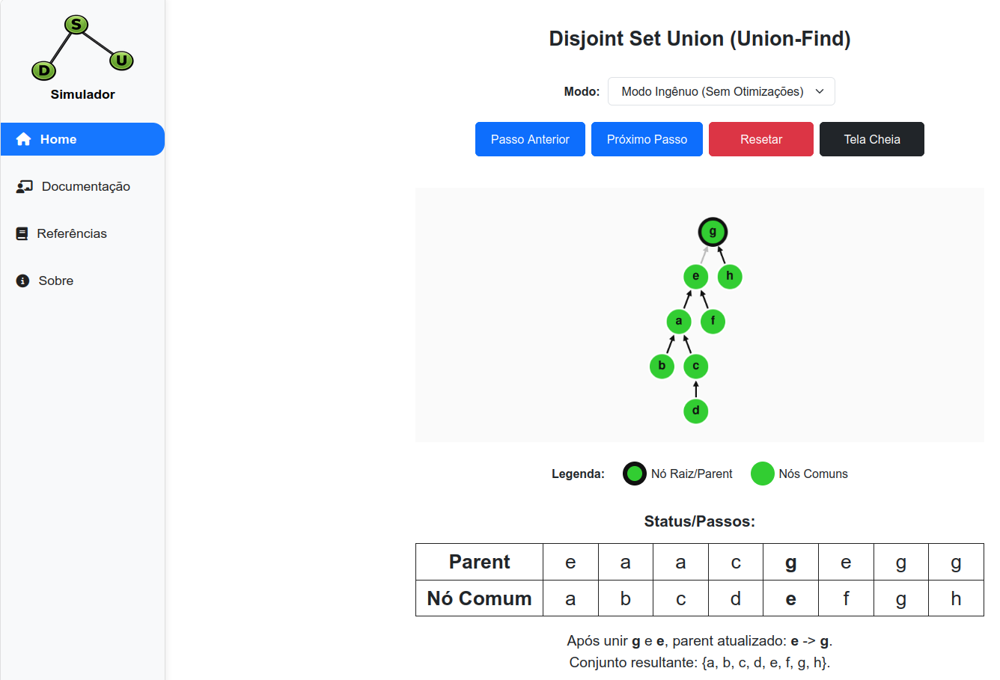

# Simulador DSU

Aplicação Web educacional para visualizar, passo a passo, o funcionamento da estrutura de dados **Disjoint Set Union (DSU)**, também conhecida como **Union-Find**.

O projeto mostra como os conjuntos são unidos, como o vetor `parent` é atualizado e como a operação `find` atua nos modos com **Path Compression**.



Link do vídeo de demostração: `https://www.youtube.com/watch?v=Roj-6bYSoOY`

## Estrutura

```text
.
├── .gitignore                     ← Arquivos/pastas ignorados no Git
├── app.js                         ← Servidor Express + configuração de views e arquivos estáticos
├── package.json                   ← Scripts do projeto e dependências
├── package-lock.json              ← Versões exatas das dependências instaladas
├── README.md                      ← Documentação do projeto
├── routes/
│   ├── index.js                   ← Rotas principais da aplicação
│   └── documentacao.js            ← Rotas da Documentação
├── views/
│   ├── components/                ← Partials reutilizáveis (head, layout, sidebar)
│   ├── docs/                      ← Páginas da Documentação
│   ├── dsu.ejs                    ← Página da visualização interativa do DSU
│   ├── referencias.ejs            ← Página de Referências e Podcast
│   ├── sobre.ejs                  ← Página Sobre
│   ├── not-found.ejs              ← Página padrão para rotas não encontradas
│   └── server-error.ejs           ← Página padrão para erros 500
└── public/
    ├── css/
    │   ├── base.css               ← Estilos base (sidebar + layout)
    │   ├── dsu.css                ← Estilos da visualização DSU
    │   ├── docs.css               ← Estilos das páginas de Documentação/Referências
    │   ├── errors.css             ← Estilos das páginas de erro (404/500)
    │   └── about.css              ← Estilos da página Sobre
    ├── js/
    │   ├── dsu.js                 ← Implementação das estruturas DSU
    │   ├── dsu-controller.js      ← Controle dos modos, botões, passos e busca
    │   └── dsu-visual.js          ← Renderização do grafo, tabela e textos explicativos
    └── img/                        ← Imagens (logo e avatares)
```

## Páginas

| URL | Descrição |
|---|---|
| `/` | Visualização interativa do Disjoint Set Union |
| `/documentacao` | Índice da Documentação |
| `/documentacao/dsu-sem-otimizacoes` | DSU sem otimizações (explicação) |
| `/documentacao/union-by-size-path-compression` | Union by Size + Path Compression (explicação) |
| `/documentacao/union-by-rank-path-compression` | Union by Rank + Path Compression (explicação) |
| `/referencias` | Referências e Podcast |
| `/sobre` | Sobre |
| Outras rotas | Página padrão de erro 404 |

## Modos disponíveis

| Modo | O que demonstra |
|---|---|
| Modo Ingênuo (Sem Otimizações) | União simples, sem heurística de otimização |
| Union by Size + Path Compression | União pelo tamanho do conjunto e compressão de caminho no `find` |
| Union by Rank + Path Compression | União pelo rank da raiz e compressão de caminho no `find` |

## Tecnologias utilizadas

### Back-end

| Tecnologia | Uso |
|---|---|
| Node.js | Runtime JavaScript |
| Express | Servidor HTTP e rotas |
| EJS | Templates HTML renderizados pelo servidor |

### Front-end

| Tecnologia | Uso |
|---|---|
| Bootstrap 5.3.2 | Estilos de botões, selects e organização visual |
| Cytoscape 3.26.0 | Desenho e animação do grafo |
| Font Awesome 6.5.0 | Ícones (servido localmente) |
| JavaScript Modules | Separação da lógica em arquivos independentes |
| CSS | Ajustes visuais específicos da simulação |

## Como a visualização funciona

- O arquivo `dsu.js` mantém a estrutura de dados e o histórico dos estados.
- O arquivo `dsu-controller.js` controla as ações do usuário, como avançar, voltar, resetar e executar `find`.
- O arquivo `dsu-visual.js` transforma o estado atual do DSU em grafo, tabela e explicação textual.
- O grafo mostra cada nó apontando para seu `parent`.
- A tabela mostra o vetor `parent` e, nos modos otimizados, mostra `rank` ou `size` apenas nas raízes.
- Nos modos com Path Compression, a busca pode ser avançada passo a passo para mostrar cada atualização do vetor `parent`.

## Conceitos demonstrados

- **Parent**: vetor que indica para onde cada elemento aponta.
- **Raiz**: elemento que aponta para si mesmo, ou seja, `parent[x] === x`.
- **Find**: operação que encontra a raiz do conjunto de um elemento.
- **Union**: operação que une dois conjuntos.
- **Union by Size**: mantém árvores menores ligadas a árvores maiores.
- **Union by Rank**: usa uma estimativa de altura para manter árvores mais rasas.
- **Path Compression**: após uma busca, faz os nós do caminho apontarem diretamente para a raiz.

## Pré-requisitos

- Node.js
- npm

## Como rodar

### 1. Instalar dependências

```bash
npm install
```

### 2. Iniciar o servidor

```bash
npm start
```

### (Opcional) Rodar em modo desenvolvimento (auto-reload)

```bash
npm run dev
```

### 3. Acessar a visualização

```text
http://localhost:3000
```

## Scripts disponíveis

| Comando | Descrição |
|---|---|
| `npm start` | Inicia o servidor Express |
| `npm run dev` | Inicia com auto-reload via nodemon |
